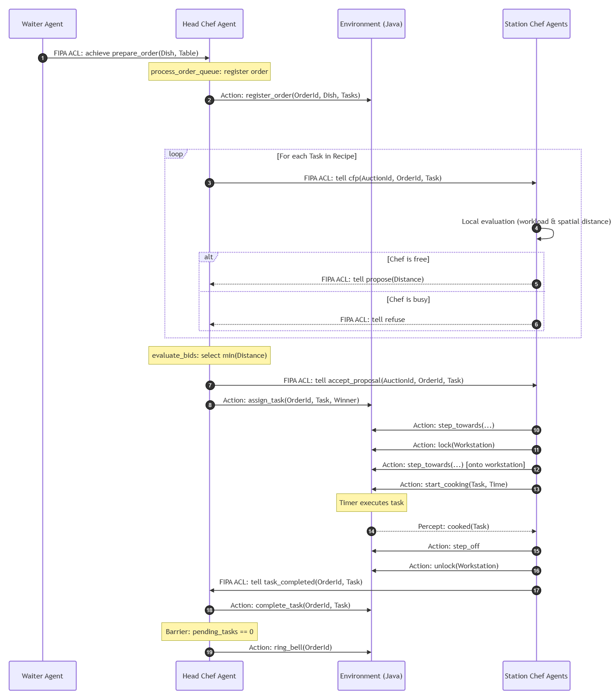

# 2. System Architecture & Design

To manage the complexity of the domain and ensure cohesion and low coupling, the system design applies the Separation of Concerns (SoC) principle, cleanly dividing the physical mechanics of the simulation from the cognitive reasoning of the autonomous entities.

This section illustrates the system engineering using a top-down approach, moving from the high-level boundaries down to the specific interactions among the autonomous agents.

## 2.1 System Context

At the highest level of abstraction, ChefSync is an isolated simulation observed by a human user. The system boundaries encapsulate the entire operational logic, meaning the MAS requires no external APIs or network services to function once booted.

The human observer interacts passively, launching the simulation and monitoring the progression of events through the Graphical User Interface (GUI) and standard output logs. The MAS dynamically generates demand internally (via the Waiter agent), coordinates task allocation (via the Head Chef), and executes actions physically (via the Station Chefs) within the simulated environment.

## 2.2 Architectural Dichotomy

The architecture of ChefSync enforces a clean separation between the **Physical Layer** (representing the environment) and the **Logical Layer** (representing the cognitive agents).

### The Physical Layer (Java)
Implemented in Java 21, the physical layer represents the world where the agents are situated and acts as the "Body" of the system. It consists of three primary components matching the Model-View-Controller (MVC) paradigm adapted for MAS:
* **The Environment (`KitchenEnv`):** Serves as the gateway between the BDI agents and the physical simulator. It intercepts BDI action requests, translates them into physical interactions, manages role-based permissions (RBAC), and maps physical changes back into logical perceptions.
* **The Model (`KitchenModel`):** Maintains the physical state of the grid, coordinates spatial locations, and manages workstations. Concurrency control and mutual exclusion on workstations (locks) are enforced at this level, ensuring that only one agent can occupy and lock a workstation at a time to prevent state corruption.
* **The View (`KitchenView`):** A Swing-based Graphical User Interface containing the 2D grid visualizer and an interactive dashboard panel that displays the order history and real-time task completion breakdown.

### The Logical Layer (Jason / AgentSpeak)
The logical layer represents the "Mind" of the system. It encapsulates the Multi-Agent System where reasoning, BDI deliberation, and social interaction occur:
* **BDI Reasoning Engines:** The agents are programmed in AgentSpeak(L) and run on the Jason BDI architecture. They possess cognitive states composed of Beliefs (knowledge of recipe steps, workstation locations, and agent roles), Desires (orders to prepare), and Intentions (active plans executed to fulfill those desires).
* **FIPA ACL Communication:** The agents have no direct access to the memory of other agents. All task delegation, synchronization, and workflow progress are achieved through message passing using FIPA Agent Communication Language (FIPA ACL).

## 2.3 Interaction & Order Lifecycle

The operational flow of ChefSync is not statically programmed; it dynamically emerges from the social interactions and negotiation protocols among autonomous agents.

The lifecycle of an order is structured as a FIPA-compliant ContractNet Protocol (CNP) coupled with spatial grid actions and order-prioritization constraints:

1. **Order Request (Waiter to Head Chef):** The Waiter Agent acts as the initiator of demand, sending a FIPA ACL message with the `achieve` communicative act (`prepare_order(Dish, Table)`) to the Head Chef.
2. **Decomposition & Registration:** The Head Chef decomposes the macro-goal (the dish) into atomic sub-tasks and immediately registers the order in the physical environment using the `register_order` action. This guarantees the order is tracked on the user dashboard in real-time.
3. **Asynchronous Processing & Parallel Auctioning:** Incoming orders are processed dynamically as they are received. Upon dequeuing an order, the Head Chef decomposes the macro-goal and initiates parallel auctions for its sub-tasks. Because multiple orders can be processed asynchronously, task negotiations can overlap, allowing the brigade to dynamically self-organize based on real-time availability and spatial positioning.
4. **Negotiation (ContractNet Protocol):** 
   * **CFP:** The Head Chef broadcasts `cfp(AuctionId, OrderId, Task)` to all Station Chefs.
   * **Propose / Refuse:** Station Chefs atomically evaluate their cognitive availability (`workload` and `pending_bids`) and spatial distance to the target workstation. They propose a bid (equal to the Manhattan distance) or refuse.
   * **Accept / Reject:** The Head Chef awards the task (`accept_proposal`) to the lowest bidder, rejects the others (`reject_proposal`), and notifies the physical environment via `assign_task`.
5. **Execution (Station Chef & Environment):** The winning Station Chef navigates the grid toward the workstation, acquires a mutual exclusion lock, steps onto the workstation, and executes `start_cooking`. When the cooking timer finishes, the chef steps off, releases the lock, and informs the Head Chef using `task_completed`.
6. **Barrier Synchronization & Service:** The Head Chef tracks completed tasks through a barrier counter. When the count of remaining tasks for the order reaches zero, the Head Chef marks the order as complete, calls `ring_bell(OrderId)` in the environment, and clears the barrier.

The following diagram illustrates this multi-agent interaction and environmental feedback lifecycle:

  
   
  <em>Figure 2.1: Sequence Diagram of the Order and Task Lifecycle</em>

